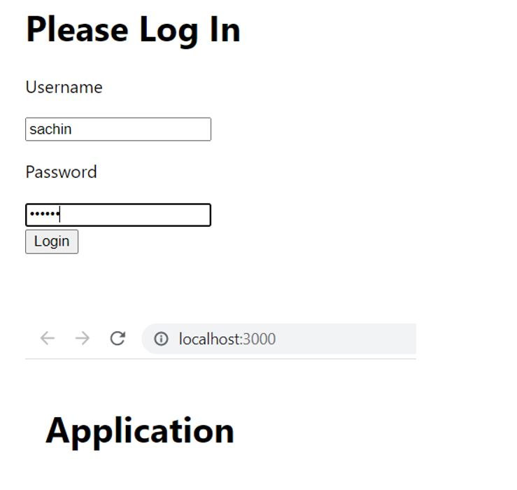
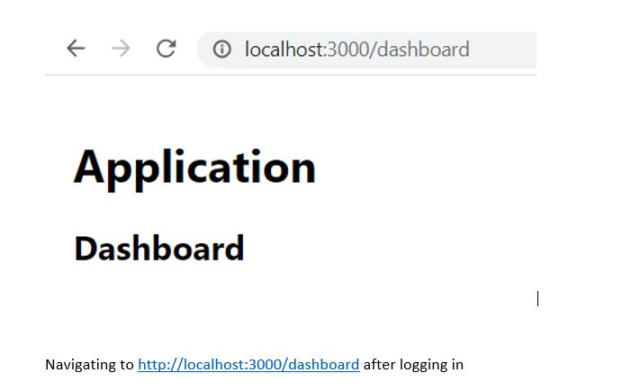
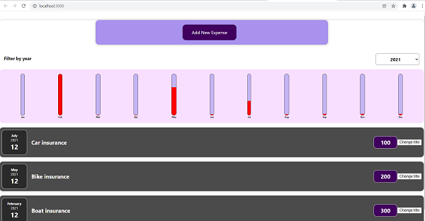
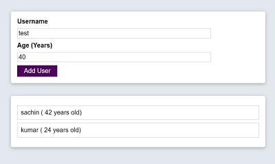

# react-js

> React Login UI

> React App

> Add User App

Reference
- https://www.udemy.com/course/react-the-complete-guide-incl-redux/
- https://www.digitalocean.com/community/tutorials/how-to-add-login-authentication-to-react-applications
